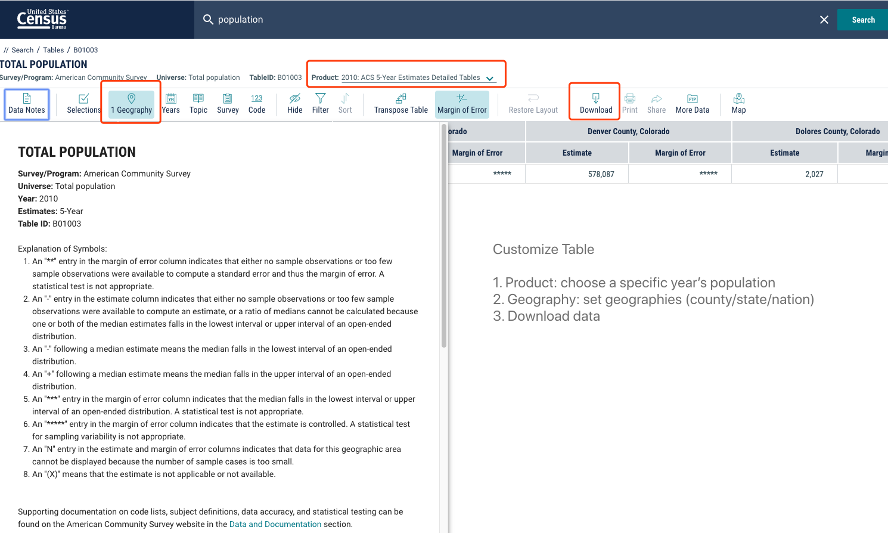

<style>
#TOC {
  background: url("https://opencasestudies.github.io/img/logo.jpg");
  background-size: contain;
  padding-top: 240px !important;
  background-repeat: no-repeat;
}
</style>


<!-- Open all links in new tab-->  
<base target="_blank"/> 

```{r setup, include=FALSE}
knitr::opts_chunk$set(include = TRUE, comment = NA, echo = TRUE,
                      message = FALSE, warning = FALSE, cache = FALSE,
                      fig.align = "center", out.width = '90%')
library(here)
library(knitr)
```

#### {.outline }
```{r, echo=FALSE}
knitr::include_graphics(here("img",
                             "API.png"))
```
####

#### {.disclaimer_block}

**Disclaimer**: The purpose of the [Open Case Studies](https://opencasestudies.github.io){target="_blank"} project is **to demonstrate the use of various data science methods, tools, and software in the context of messy, real-world data**. A given case study does not cover all aspects of the research process, is not claiming to be the most appropriate way to analyze a given data set, and should not be used in the context of making policy decisions without external consultation from scientific experts. 

####

#### {.license_block}

This work is licensed under the Creative Commons Attribution-NonCommercial 3.0 [(CC BY-NC 3.0)](https://creativecommons.org/licenses/by-nc/3.0/us/){target="_blank"} United States License.

####

#### {.reference_block}

To cite this case study please use:

Wright, Carrie, and Ontiveros, Michael and Jager, Leah and Taub, Margaret and Hicks, Stephanie. (2020). https://opencasestudies.github.io/ocs-bp-opioid-rural-urban/ocs_pop.html. Opioids in the United States (Version v1.0.0).

avocado update url
####

# **Motivation**
*** 

Washington Post case study:
- Question: How did opioid prescription rates differ by region over time around the US from 2006-2012?
- Description: We will evaluate prescription rates of opioid pain medication across states/counties from 2006-2012.  We will investigate how rural and urban areas differ for prescription rates. We will reference work like this as our motivation: https://www.cdc.gov/mmwr/volumes/68/wr/mm6802a1.htm?s_cid=mm6802a1_w
- Why is this important? This analysis demonstrates how different regions of the country may have been more at risk for opioid addiction crises due to differing rates of opioid prescription. This will help inform students about how evidence-based intervention decisions are made in this area.
- Data:  The data is now obtainable from an R package called arcos. In addition we will use information about state and county urbanization estimates from here: https://www.census.gov/programs-surveys/geography/guidance/geo-areas/urban-rural/2010-urban-rural.html
- Major Data Science Objectives:
1) loading data from data package
2) wrangling - joining dplyr
3) map visualization - ggplot /maps/mapdata/ggmap
- Statistics objectives: Linear regression analysis to evaluate the association of urbanization/population density and opioid prescription rates over time.

This case study is motivated by this [article](https://www.cdc.gov/mmwr/volumes/68/wr/mm6802a1.htm?s_cid=mm6802a1_w):

#### {.reference_block}

García, M. C. et al. Opioid Prescribing Rates in Nonmetropolitan and Metropolitan Counties Among Primary Care Providers Using an Electronic Health Record System — United States, 2014–2017. MMWR Morb. Mortal. Wkly. Rep. 68, 25–30 (2019). DOI: [http://dx.doi.org/10.15585/mmwr.mm6802a1](http://dx.doi.org/10.15585/mmwr.mm6802a1)

####

This article explores rates of opioid shipments to rural and urban communties and the difficulties of intereting such data.


This article states that

> "

However previous studies note some commonalities such as:

> ""


They also point out that:

> ""

Given this need for more research to better understand why these events occur and how they could be averted, in this case study we will demonstrate how to create a resource for others to more easily and interactively access data about school shootings. To do so we will create what is called a [dashboard](https://en.wikipedia.org/wiki/Dashboard_(business)), which is a website that displays a report for a database. Dashboards summarize the data in a database and typically allow for users to interact with the data in some way.

[Here](https://beta.rstudioconnect.com/jjallaire/htmlwidgets-highcharter/htmlwidgets-highcharter.html) you can see an example of a dashboard created in R.


####[[source]](https://beta.rstudioconnect.com/jjallaire/htmlwidgets-highcharter/)


# **Main Questions**
*** 

#### {.main_question_block}
<b><u> Our main questions: </u></b>

1) What has been the yearly rate of school shootings and where have they occurred in the last 50 years (from January 1970 to June 2020)? 

2) What are the characteristics of these events?

####

# **Learning Objectives** 
*** 

In this case study, we will demonstrate how to create a [dashboard](https://en.wikipedia.org/wiki/Dashboard_(business)), which is a website that displays a report about a database. We will especially focus on using packages and functions from the [`Tidyverse`](https://www.tidyverse.org/){target="_blank"}, such as `package_name`, `package_name`. The tidyverse is a library of packages created by RStudio. While some students may be familiar with previous R programming packages, these packages make data science in R more legible and intuitive.


```{r, out.width = "20%", echo = FALSE, fig.align ="center"}
include_graphics("https://tidyverse.tidyverse.org/logo.png")
```

The skills, methods, and concepts that students will be familiar with by the end of this case study are:


Data science skills:  
  
1. Importing text from a Google Sheets document (`googlesheets4`)  
2. Converting date formats (`lubridate`)  
3. Geocoding data (`ggmap`)  and creating a jitter for geocoded data on a map (`SF`)
4. How to reshape data by pivoting between "long" and "wide" formats and drop rows with `NA` values (`tidyr`)  
5. How to create data visualizations with `ggplot2` 
6. An introductory understand of R Markdown  
7. How to create an interactive table (`DT`)  
8. How to create a map (`leaflet`)  
9. How to create an interactive dashboard with `flexdashboard` and `shiny`  

Statistical concepts and methods:  
  
1. Calculating percentages for data with missing values  

*** 


We will begin by loading the packages that we will need:


```{r}
library(httr)
library(jsonlite)
library(here)
library(readr)
library(readxl)
library(devtools)
library(usethis)
library(tidyverse)
library(openintro)
#library(arcos)
library(ggiraph)
library(ggpubr)
library(ggfortify)
library(ggpol)
library(lme4)
library(formattable)
library(reshape2)
```


 <u>**Packages used in this case study:** </u>

Package   | Use in this case study                                                                      
---------- |-------------
[here](https://github.com/jennybc/here_here){target="_blank"}       | to easily load and save data  
[readr](https://readr.tidyverse.org/) |  to import the data  as a csv file  
[googlesheets4](https://googlesheets4.tidyverse.org/) | to import directly from Google Sheets
[tibble](https://tibble.tidyverse.org/) | to create tibbles (the tidyverse version of dataframes)
[dplyr](https://dplyr.tidyverse.org/){target="_blank"}      | to filter, subset, join, add rows to, and modify the data  
[stringr](https://stringr.tidyverse.org/){target="_blank"}      | to manipulate  character strings within the data (collapsing strings together, replace values, and detect values)
[magrittr](https://magrittr.tidyverse.org/){target="_blank"}      | to pipe sequential commands 
[tidyr](https://tidyr.tidyverse.org/){target="_blank"}      | to change the shape or format of tibbles to wide and long, to drop rows with `NA` values, and to see the last few columns of a tibble
[ggmap](https://cran.r-project.org/web/packages/ggmap/ggmap.pdf) | to geocode the data (which means get the latitude and longitude values)
[sf](https://r-spatial.github.io/sf/) | to modify the geocoded data so that overlapping points did not overlap
[lubridate](https://lubridate.tidyverse.org/) | to work with the data-time data    
[DT](https://rstudio.github.io/DT/) | to create the interactive table  
[htmltools](https://www.rdocumentation.org/packages/htmltools/versions/0.5.0) | to add a caption to our interactive table 
[ggplot2](https://ggplot2.tidyverse.org/){target="_blank"}      | to create plots  
[ggforce](https://cran.r-project.org/web/packages/ggforce/ggforce.pdf)   | to create a plot zoom
[forcats](https://forcats.tidyverse.org/){target="_blank"}      | to reorder factor for plot
[waffle](https://github.com/hrbrmstr/waffle) | to make waffle proportion plots  
[poliscidata](https://cran.r-project.org/web/packages/poliscidata/poliscidata.pdf) | to get population values for the states
[flexdashboard](https://rmarkdown.rstudio.com/flexdashboard/)     | to create the dashboard  
[shiny](https://shiny.rstudio.com/){target="_blank"}      | to allow our dashboard to be interactive   
[leaflet](https://rstudio.github.io/leaflet/shiny.html) | to implement the [leaflet](http://leafletjs.com/) (a JavaScript library for maps) to create the map for our dashboard   

The first time we use a function, we will use the `::` to indicate which package we are using. Unless we have overlapping function names, this is not necessary, but we will include it here to be informative about where the functions we will use come from.


# **Context**
*** 

According to this [article](https://www.cdc.gov/mmwr/volumes/68/wr/mm6802a1.htm?s_cid=mm6802a1_w) from the [Morbidity and Mortality Weekly Report (MMWR)](https://www.cdc.gov/mmwr/about.html) of the [Centers for Disease Control and Prevention (CDC)](https://en.wikipedia.org/wiki/Centers_for_Disease_Control_and_Prevention)

> Drug overdose is the leading cause of unintentional injury-associated death in the United States.


https://lancasteronline.com/news/local/report-compares-drug-overdoses-to-other-causes-of-death-in-the-us/article_24efaa58-dc50-11e7-869e-f39fbf46bfa2.html


According to this [article](https://www.cdc.gov/mmwr/volumes/67/wr/mm675152e1.htm?s_cid=mm675152e1_w) 


```{r}
knitr::include_graphics("https://www.cdc.gov/mmwr/volumes/67/wr/figures/mm675152e1-F.gif")

```

[[source]](https://www.cdc.gov/mmwr/volumes/67/wr/figures/mm675152e1-F.gif)

```{r}
knitr::include_graphics(here::here("img", "context.png"))

```

##### [[source]](https://www.cdc.gov/mmwr/volumes/68/wr/pdfs/mm6802a1-H.pdf)
 
https://www.cdc.gov/nchs/products/databriefs/db356.htm


 
# **Limitations**
*** 
There are some important considerations regarding this data analysis to keep in mind: 

1) This analysis is exploratory and, as such, does not intend to provide inferential conclusions.  

2) This dashboard only uses one source of data. There may be school shooting events that are not listed in this data or errors in this data.

According to the database website:

>"This database was developed from open-source information and may include reporting errors."

Furthermore, according to this [article](https://link.springer.com/article/10.1007/s11920-012-0331-6) schools are not required to report school shootings unless they resulted in a suicide or homicide, therefore there may be more events that result in only injury or no injuries or death that may not be included.

There are indeed events in the dataset that include zero deaths and zero injuries, but it is very likely that many of these events are not listed.

Avocado... this source from 2013 says that schools are not required to report.. is this still true?


# **What are the data?**
*** 

We will use data two sources:

1) The US census for population and urabnicity ratings
2) The [Washington Post data](https://www.washingtonpost.com/national/2019/07/18/how-download-use-dea-pain-pills-database/)from the [Drug Enforcement Administration (DEA)](https://www.dea.gov/) about opioid shipments to pharmacies around the US

This dataset was released in July of 2019 and has been controversial as according to the Washington Post:

> The disclosure is part of a civil action brought by 2,500 cities, towns, counties and tribal nations alleging that nearly two dozen drug companies **conspired to saturate the nation with opioids**.

See [here](https://www.washingtonpost.com/national/2019/07/20/opioid-files/?arc404=true) for more details about how this database was released.


This data was part of the [Automated Reports and Consolidated Ordering System (ARCOS)]https://www.deadiversion.usdoj.gov/arcos/retail_drug_summary/ of the DEA in which:

> manufacturers and distributors report their controlled substances transactions


The annual report about the data from 2019, can be found [here](https://www.deadiversion.usdoj.gov/arcos/retail_drug_summary/report_yr_2019.pdf).

As this is a very large dataset, thus the Washington Post created an [application prgoramming interface (API)](https://en.wikipedia.org/wiki/API)  to make it easier for users to access the data. 

An API is a computational interface that simplifies interactacts with a data or file system for a user. It is similar to a [Graphical User Interface GUI](https://en.wikipedia.org/wiki/Graphical_user_interface), yet it allows the user some more flexibility/functionality.


This [link](https://arcos-api.ext.nile.works/__swagger__/) takes you to the Washington Post ARCOS API. 

There was also an R package on cran called [arcos](https://cran.r-project.org/package=arcos) for interacting with the API, but this has been archived.  This package is however still available [here](https://github.com/wpinvestigative/arcos) on Github.


# population data

Data about the population of each county was otained from this [dataset](https://data.census.gov/cedsci/table?q=population&hidePreview=true&tid=ACSDT5Y2010.B01003&vintage=2018&g=0100000US.050000) from the US census.

 
 

# **Data Import**
*** 
## Accessing APIs

The `httr` package formats what are called "GET requests" so that they will work properly.
The `jsonlinte` package alows you to convert the data from `JSON` to a differet format that is easier to work with.

APIs typically require a password or key to gain access. Thus the httr package helps to authenticate your data request. Often these keys are something that you do not want to share, unless the API is public.

In our case the [API](https://arcos-api.ext.nile.works/__swagger__/) is indeed public, and currently "uO4EK6I" is published as a key to use on the [github page](https://github.com/wpinvestigative/arcos) for the `arcos` package.

https://www.washingtonpost.com/national/2019/07/18/how-download-use-dea-pain-pills-database/

## Population Data

We are interested in the county level data - first let's get the population data. We can access it by:

1) Pressing the `GET` button on the API.

```{r}
knitr::include_graphics(here::here("img", "get.png"))

```

2) Pressing the "Try it out" button.

```{r}
knitr::include_graphics(here::here("img", "tryitout.png"))
```

3) Entering the key (which we got from [here]([github page](https://github.com/wpinvestigative/arcos))).

```{r}
knitr::include_graphics(here::here("img", "key.png"))
```

4) Clicking the "Execute" button.

```{r}
knitr::include_graphics(here::here("img", "execute.png"))
```

This gives us the following output:

curl -X GET "https://arcos-api.ext.nile.works/v1/county_population?key=uO4EK6I" -H  "accept: application/json"

We can copy the URL section "https://arcos-api.ext.nile.works/v1/county_population?key=uO4EK6I" and use it in the `GET()` function of the `httr` package (note that some of the data will take longer ):

```{r}
county_pop_json<-httr::GET(url = "https://arcos-api.ext.nile.works/v1/county_population?key=uO4EK6I")
```

Now we have a [JavaScript Object Notation (JSON)](https://fileinfo.com/extension/json#:~:text=A%20JSON%20file%20is%20a,web%20application%20and%20a%20server.) file of the data. 

JSON files are [lightweight](https://en.wikipedia.org/wiki/Lightweight_programming_language) meaning that they dont take up much memory and they are human readible files that help act as an intermeidary between websites and servers and allows for easy transmission of data from for example APIs.


```{r}
county_pop_json
```
Here we can see that the object called `countyjson` is a `json` object. You will also see that the Satus is `200`, which means that we were sucessful in retreiving the data from the API.

Now we can use the `content()` funtion of the `httr` package to extract the text from the file:

```{r}
county_pop_text <-httr::content(county_pop_json, "text")
```


Now to get the data into a more readible format , we can use the `fromJson` function of the `jsonlite` package
```{r}
county_pop <- jsonlite::fromJSON(county_pop_text, flatten = TRUE)
county_pop <- tibble::as_tibble(county_pop)

glimpse(county_pop)

distinct(county_pop, year)

```


```{r, eval = FALSE}
write.csv(county_pop, file = here::here("data", "county_pop_arcos.csv"))
save(county_pop, file =  here::here("data", "county_pop_arcos.rda"))
```

```{r}
head(read.csv('data/2010.csv', header=TRUE) )
```


We are also interested in pill shipment data at the county level. 

Here is the result of the same steps for this data:

curl -X GET "https://arcos-api.ext.nile.works/v1/combined_county_monthly?key=uO4EK6I" -H  "accept: application/json"

Again, we can copy the URL section https://arcos-api.ext.nile.works/v1/combined_county_monthly?key=uO4EK6I" and use it in the `GET()` function of the `httr` package (note that this may take a minute):

```{r}
countyjson<-httr::GET(url = "https://arcos-api.ext.nile.works/v1/combined_county_monthly?key=uO4EK6I")
```

```{r, eval = FALSE}
countyjson_text <-httr::content(countyjson, "text")
```

```{r, eval = FALSE}
county <- jsonlite::fromJSON(countyjson_text, flatten = TRUE)
county <- tibble::as_tibble(county)
write.csv(county, file = here::here("data", "county_monthly.csv"))
save(county, file =  here::here("data", "county_monthly.rda"))
```


```{r}
monthlyDosage <- read.csv(here::here("data", "county_monthly.csv"), header=TRUE, row.names=1)
                          
head(monthlyDosage)
distinct(monthlyDosage, year)

```


```{r}
dfAnnualDosage <- read.csv(here::here("data", "annual_dosage_unit.csv"), header=TRUE, row.names=1) %>%
  mutate(FIPS = as.character(FIPS))

head(dfAnnualDosage)
```


# **Data Exploration and Wrangling**
***

Classify population as being rural or urban based on the criteria of greater than 50,000
https://www.ers.usda.gov/topics/rural-economy-population/rural-classifications/what-is-rural/
```{r}
county_pop %>%
  mutate(rural_urban = case_when(population > 50000 ~ "Urban",
                                 population <= 50000 ~ "Rural"))

```


```{r, eval = FALSE}
left_join(monthlyDosage, county_pop)

```

# **Data Analysis and Visualization**
***
# **Summary**
*** 

## Summary Plot

## Synopsis

In this case study we have demonstrated the basics of R Markdown and how to create a dashboard with using the `flexdashboard` package. We also demonstrated how to include an interactive table with the `DT` package, how to include interactive plots using functions of the `shiny` package such as `renderPlot()`. We also included interactive value boxes using the `renderValueBox()` function of the `flexdashboard` package which works with the `shiny` package. Finally we also showed how to include interactive maps using the `leaflet` package. 

This case study also explored how to properly calculate and interpret percentages when the data has missing values. We also discussed the benefits and limiting aspects of pie charts (using `ggplot2`) and waffle plots (using `waffle`).

Overall the dashboard that we created shows that the number of shootings per year has increased overtime. Further investigation is necessary to determine if this is simply due to increases in population alone or if the rate has increased due to other factors and if so, what those factors might be. It is also clear that the number of shootings and the number of deaths per capita varies by state. Thus there appears to be other aspects accounting for state differences. 

# **Suggested Homework**
*** 

Create another dashboard with graphs and statistics featuring other elements within this dataset. For example, students may create graphs that explore what school events are reported to have more shootings.


# **Additional Information**
***

## Helpful Links

[RStudio](https://rstudio.com/products/rstudio/features/){target="_blank"}  
[Cheatsheet on RStuido IDE](https://github.com/rstudio/cheatsheets/raw/master/rstudio-ide.pdf){target="_blank"}  
[Other RStudio cheatsheets](https://rstudio.com/resources/cheatsheets/){target="_blank"}   
[RStudio projects](https://r4ds.had.co.nz/workflow-projects.html)

[Tidyverse](https://www.tidyverse.org/){target="_blank"}   

   

[Piping in R](https://cran.r-project.org/web/packages/magrittr/vignettes/magrittr.html){target="_blank"}   

[String manipulation cheatsheet](https://rstudio.com/resources/cheatsheets/){target="_blank"}  
[Table formats](https://en.wikipedia.org/wiki/Wide_and_narrow_data){target="_blank"}

[Geocoding](https://en.wikipedia.org/wiki/Geocoding)  
[Coordinate reference system (CRS)](https://www.w3.org/2015/spatial/wiki/Coordinate_Reference_Systems) [ESPG](https://en.wikipedia.org/wiki/EPSG_Geodetic_Parameter_Dataset)
[World Geodetic System (WGS) version 84 also called ESPG:4326 ](https://en.wikipedia.org/wiki/World_Geodetic_System#WGS84)   
[Albers equal-area conic projection](https://en.wikipedia.org/wiki/Albers_projection#:~:text=The%20Albers%20equal%2Darea%20conic,that%20uses%20two%20standard%20parallels.&text=The%20Albers%20projection%20is%20used,the%20United%20States%20Census%20Bureau.)   
[crs 102008](https://spatialreference.org/ref/esri/102008/html/)  

To learn more about geospatial coordinate systems see [here](https://www.nceas.ucsb.edu/sites/default/files/2020-04/OverviewCoordinateReferenceSystems.pdf) and [here](https://guides.library.duke.edu/r-geospatial/CRS).


[`ggplot2` package](http://ggplot2.tidyverse.org){target="_blank"}    
Please see [this case study](https://opencasestudies.github.io/ocs-bp-co2-emissions/)  for more details on using `ggplot2`    
[grammar of graphics](http://vita.had.co.nz/papers/layered-grammar.html){target="_blank"}   
[`ggplot2` themes](https://ggplot2.tidyverse.org/reference/ggtheme.html){target="_blank"}   

[Motivating article for this case study about school shootings](https://link.springer.com/content/pdf/10.1007/s11920-012-0331-6.pdf)

Also see this [article](https://siepr.stanford.edu/sites/default/files/publications/19-036.pdf) to learn more about the impacts of school shootings.


[Lightweight markup languages(LML)](https://en.wikipedia.org/wiki/Lightweight_markup_language)  
[Markdown](https://en.wikipedia.org/wiki/Markdown)  
[R markdown](http://rmarkdown.rstudio.com/)   
[`knitr`](https://yihui.org/knitr/)  
[`rmarkdown` (package)](https://cran.r-project.org/web/packages/rmarkdown/rmarkdown.pdf)

See this [book](https://bookdown.org/yihui/rmarkdown/) for more information on working with R Markdown files. 

The RStudio [cheatsheet for R Markdown](https://github.com/rstudio/cheatsheets/raw/master/rmarkdown-2.0.pdf) and this [tutorial](https://ourcodingclub.github.io/tutorials/rmarkdown/) are great for getting started. 

[Pandoc](https://en.wikipedia.org/wiki/Pandoc)  

[YAML](https://en.wikipedia.org/wiki/YAML)  
[Configuration](https://en.wikipedia.org/wiki/Configuration_file)  

[flexdashboard](https://rmarkdown.rstudio.com/flexdashboard/)  

See [here](https://rstudio.com/resources/webinars/introducing-flexdashboards/) for a video about flexdashboard and [here](https://rmarkdown.rstudio.com/flexdashboard/) for a more information on how to use this package.   
See [here](https://rmarkdown.rstudio.com/flexdashboard/using.html#components) for a list of other packages that are useful for adding elements to dashboards created with the `flexdashboard` package.   
See [here](https://www.datadreaming.org/post/r-markdown-theme-gallery/) for a list of R Markdown themes which can be used with `flexdashbard`.   
See [Font Awesome](https://fontawesome.com/icons?d=gallery) for icons.  

To learn more about using `shiny` with the `flexdashboard` package to create interactive dashboards, see this [tutorial](https://rmarkdown.rstudio.com/flexdashboard/shiny.html).   

[leaflet (R package)](https://rstudio.github.io/leaflet/)   
[Leaflet (JavaScript Library)](https://leafletjs.com/)   

[shiny](https://shiny.rstudio.com/)  
See [here](https://shiny.rstudio.com/gallery/) for a gallery of `shiny` examples.

See this [website](https://rstudio.github.io/shinydashboard/) to learn about a more flexible and slightly more challenging option for creating dashboards in R using a package called `shinydashboard`.


<u>**Packages used in this case study:** </u>

Package   | Use in this case study                                                                      
---------- |-------------
[here](https://github.com/jennybc/here_here){target="_blank"}       | to easily load and save data  
[readr](https://readr.tidyverse.org/) |  to import the data  as a csv file  
[googlesheets4](https://googlesheets4.tidyverse.org/) | to import directly from Google Sheets
[tibble](https://tibble.tidyverse.org/) | to create tibbles (the tidyverse version of dataframes)
[dplyr](https://dplyr.tidyverse.org/){target="_blank"}      | to filter, subset, join, add rows to, and modify the data  
[stringr](https://stringr.tidyverse.org/){target="_blank"}      | to manipulate  character strings within the data (collapsing strings together, replace values, and detect values)
[magrittr](https://magrittr.tidyverse.org/){target="_blank"}      | to pipe sequential commands 
[tidyr](https://tidyr.tidyverse.org/){target="_blank"}      | to change the shape or format of tibbles to wide and long, to drop rows with `NA` values, and to see the last few columns of a tibble
[ggmap](https://cran.r-project.org/web/packages/ggmap/ggmap.pdf) | to geocode the data (which means get the latitude and longitude values)
[sf](https://r-spatial.github.io/sf/) | to modify the geocoded data so that overlapping points did not overlap
[lubridate](https://lubridate.tidyverse.org/) | to work with the data-time data    
[DT](https://rstudio.github.io/DT/) | to create the interactive table  
[htmltools](https://www.rdocumentation.org/packages/htmltools/versions/0.5.0) | to add a caption to our interactive table 
[ggplot2](https://ggplot2.tidyverse.org/){target="_blank"}      | to create plots  
[ggforce](https://cran.r-project.org/web/packages/ggforce/ggforce.pdf)   | to create a plot zoom
[forcats](https://forcats.tidyverse.org/){target="_blank"}      | to reorder factor for plot
[waffle](https://github.com/hrbrmstr/waffle) | to make waffle proportion plots  
[poliscidata](https://cran.r-project.org/web/packages/poliscidata/poliscidata.pdf) | to get population values for the states
[flexdashboard](https://rmarkdown.rstudio.com/flexdashboard/)     | to create the dashboard  
[shiny](https://shiny.rstudio.com/){target="_blank"}      | to allow our dashboard to be interactive   
[leaflet](https://rstudio.github.io/leaflet/shiny.html) | to implement the [leaflet](http://leafletjs.com/) (a JavaScript library for maps) to create the map for our dashboard   


#### {.emphasis_block}

**Warning Signs**

From [Sandy Hook Promise](https://www.sandyhookpromise.org/gun-violence/know-the-signs-of-gun-violence/)...

Here is a list of potential warning signs that can signal an individual may be in crisis and/or need help:

+ Suddenly withdrawing from people and activities
+ Consistent bullying or intimidating others, or being bullied by others
+ Extreme mood or personality changes
+ Victim of constant social rejection
+ Talking about plans or actively making plans to harm themselves or others
+ Bringing a weapon to school – or threatening or talking about doing so
+ Bragging about or warning others about an upcoming act of violence
+ Recruiting others to join in a planned act of violence
+ Warning students to stay away from school or events
+ Expressing fascination with guns and/or school shootings
+ Expressing hopelessness about the future
+ Extreme, prolonged sadness or distress
+ Expressing or showing feelings of isolation
+ Bragging about access to guns

**NOTE**

This list is not a comprehensive list of warning signs nor does exhibiting one of these signs indicate imminent violence.

When concerned about seeing troubling behaviors, tell a trusted adult or call 911, if there is an immediate threat.

**Respond to Warning Signs**

Call 911 if you feel there is an immediate threat. 

Call [+1-844-5-SAYNOW](tel:18445729669) if you would to submit an anonymous safety concern.


If you or your child or student experienced a shooting please see this [website](https://kidshealth.org/en/parents/ptsd.html) and this [website](https://www.verywellmind.com/shooting-ptsd-from-a-shooting-2797200) for guidance about dealing with the trauma.


####

## Session Info

```{r}
sessionInfo()
```


## Acknowledgements

We would like to acknowledge [Elizabeth Stuart](https://www.jhsph.edu/faculty/directory/profile/1792/elizabeth-a-stuart) for assisting in framing the major direction of the case study.

We would also like to acknowledge the [Bloomberg American Health Initiative](https://americanhealth.jhu.edu/) for funding this work. 

