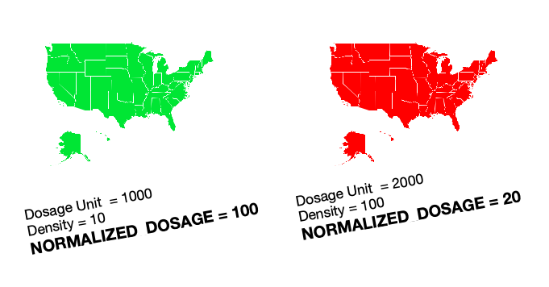

```{r setup, include=FALSE}
knitr::opts_chunk$set(echo = TRUE, message = FALSE,
                      warning = FALSE)
```


# data preparation

```{r}
library(readxl)
library(devtools)
library(usethis)
library(tidyverse)
library(openintro)
#library(arcos)
library(ggiraph)
library(ggpubr)
library(ggfortify)
library(ggpol)
library(lme4)
library(formattable)
library(reshape2)
```


Question: How did opioid prescription amount 
differ by region over time around the US from 2006-2013?

Description: We will evaluate prescription amount
of opioid pain medication across states/counties from 2006-2013. 
We will investigate how rural and urban areas differ for prescription rates. 

Analysis of patient opioid prescription data from 
a national electronic health record vendor during 2014 - 2017 
found that the percentage of patients prescribed an opioid 
was higher in rural than in urban areas. Significant decreases 
in opioid prescribing occurred across all urban-rural categories
after the March 2016 release of the CDC Guideline for Prescribing Opioids for Chronic Pain.


Statistics objectives: Linear regression analysis to evaluate 
the association of urbanization/population density and opioid prescription rates over time.


# population data

```{r}
head(read.csv('data/2010.csv', header=TRUE) )
```

Here I get the population for each county from https://data.census.gov/cedsci/table?q=population&hidePreview=true&tid=ACSDT5Y2010.B01003&vintage=2018&g=0100000US.050000
 
 
 
 
 
The ACS conducts recurring surveys every few months that 
are used for different periods. The 1-year survey does not 
use much data, and the number of observations that are reliably 
reported is resultantly restricted because of the number of 
poor estimates generated for a portion of the country. 
5 year data should suffice! 
 


```{r}
read_pop <- function(file){
  read.csv( file, header=TRUE) %>% slice(2:n()) %>% 
  mutate(FIPS = str_sub(GEO_ID, -5,-1), POP = as.numeric(as.character(B01003_001E))  ) %>% 
  select(FIPS, POP)
}

pop2010 <- read_pop('data/2010.csv')
pop2011 <- read_pop('data/2011.csv')
pop2012 <- read_pop('data/2012.csv')
pop2013 <- read_pop('data/2013.csv')
pop2014 <- read_pop('data/2014.csv')
```


## Washinton Post

```{r}
dfCSSraw <- read_excel("data/PctUrbanRural_County.xls")

```

`dfcss` is used to save urban and rural in 2010 and calculate the total number 


1. 1 sq meters = 3.8610215854781257e-7 sq miles


2. Today, "urban areas" consist of two types of geographies:


"Urbanized Areas" have a population of 50,000 or more.
"Urban Clusters" have a population of at least 2,500 and less than 50,000.

```{r}
dfCSSraw$COUNTYNAME <- gsub('LaSalle','La Salle', dfCSSraw$COUNTYNAME)
dfCSSraw$COUNTYNAME <- gsub('Do??a Ana','Dona Ana', dfCSSraw$COUNTYNAME)


dfcss <- dfCSSraw %>% select(STATE,COUNTY,STATENAME,COUNTYNAME,
  POP_COU,AREA_COU, POP_URBAN,POPPCT_URBAN,POP_RURAL,POPPCT_RURAL) %>%
  filter(STATENAME !='Puerto Rico') %>%
  mutate(STATENAME2 = state2abbr(STATENAME), FIPS= paste(STATE,COUNTY,sep=""))

```


calculate the annual density in 2010, 2012, 2013

```{r}
L <- list( pop2010[, c('FIPS','POP')], pop2011[, c('FIPS','POP')],
           pop2012[, c('FIPS','POP')], pop2013[, c('FIPS','POP')],
           pop2014[, c('FIPS','POP')], dfcss)

DENS<- function(x){return(x/( dfcss$AREA_COU*0.0000003861)) }  
UB <- function(x){ return(ifelse( x >= 50000,'U','R')) }  


dfCSS<-Reduce(function(x,y) left_join(x, y, 
                      by = colnames(x)[1]), L)%>%  
  mutate(FIPS = str_remove(FIPS, "^0+"), 
        DENS10 = DENS(POP.x), UB10 = UB(POP.x),
        DENS11 = DENS(POP.y), UB11 = UB(POP.y),
        DENS12 = DENS(POP.x.x), UB12 = UB(POP.x.x),
        DENS13 = DENS(POP.y.y), UB13 = UB(POP.y.y),
        DENS14 = DENS(POP), UB14 = UB(POP))  %>%   
  select(FIPS,STATE= STATENAME2,COUNTY=COUNTYNAME, 
         DENS10, UB10,DENS11, UB11, DENS12, UB12,DENS13, 
         UB13,DENS14, UB14 )%>% drop_na()

summary(dfCSS)
```

### How does the density changes over years?


```{r}
dfCSS1 <- dfCSS  %>% group_by(STATE ) %>%
     summarise( mean_DENS10 = mean(DENS10),
                mean_DENS11 = mean(DENS11),
                mean_DENS12 = mean(DENS12),
                mean_DENS13 = mean(DENS13),
                mean_DENS14 = mean(DENS14))

dfCSS_m <- melt(dfCSS1 , id.vars="STATE")

 #Everything on the same plot
m1 <- ggplot(dfCSS_m , aes(STATE, value, col=variable,group = variable)) + 
  geom_point() + 
  #stat_smooth() +
  theme_minimal()+
  theme(axis.title.x=element_blank(),
        axis.text.x=element_blank())

# Separate plots
m2 <- ggplot(dfCSS_m , aes(STATE, value, col=variable,group = variable)) + 
  geom_line() + 
  facet_wrap(~variable)+
  theme_minimal()+
  theme(axis.title.x=element_blank(),
        axis.text.x=element_blank())

ggarrange(m1, m2, nrow =2)

```

The density in these states doesn't change too much from 2010 to 2014.


### How does the number of rural and urban areas change over years?

```{r}
cnt <- bind_cols(dfCSS %>% count(UB10) %>% select( Urban = UB10, count10 = n) ,
         dfCSS %>% count(UB11) %>% select( count11 = n) ,
         dfCSS %>% count(UB12) %>% select( count12 = n) ,
         dfCSS %>% count(UB13) %>% select( count13 = n),
         dfCSS %>% count(UB14) %>% select( count14 = n) ) %>% 
        mutate( Urban = as.factor(Urban) )

formattable( cnt,list( 
`count11` = formatter("span",  style = ~ style(color = 
   ifelse(`count11`>`count10`, "red", "green")), 
  ~ icontext(ifelse(`count11`>`count10`,"arrow-up", "arrow-down"), `count11`) ),
`count12` = formatter("span",  style = ~ style(color = 
   ifelse(`count12`>`count11`, "red", "green")), 
  ~ icontext(ifelse(`count12`>`count11`,"arrow-up", "arrow-down"), `count12`) ),
 `count13` = formatter("span",  style = ~ style(color = 
   ifelse(`count13`>`count12`, "red", "green")), 
  ~ icontext(ifelse(`count13`>`count12`,"arrow-up", "arrow-down"), `count13`) ),
 `count14` = formatter("span",  style = ~ style(color = 
   ifelse(`count14`>`count13`, "red", "green")), 
  ~ icontext(ifelse(`count14`>`count13`,"arrow-up", "arrow-down"), `count14`) )
 ) )

```


population data with year 2010 to 2014 density, classification result

```{r}
dfPOP <- dfCSS[,c('FIPS','STATE','COUNTY','DENS14','DENS13','DENS12','DENS11','DENS10',
                  'UB14','UB13','UB12','UB11','UB10')]

```

## DOSAGE data (remove this)


We have to use summarise function, and these two are useful function, others may provide pills for each pharmacy in a county but not what we need.

```{r, eval = FALSE}
summarized_county_annual(county = "Mingo", state = "WV",key = "WaPo") %>%
  select(FIPS = countyfips, STATE = BUYER_STATE, COUNTY = BUYER_COUNTY,DOSAGE_UNIT)
#summarized_county_monthly(county = "Mingo", state = "WV",key = "WaPo")  #300 thousand
```


```{r, eval = FALSE}
getDrug <- function(s,c){
  s = toString(s)
  c = toString(c)  
  data = summarized_county_annual(county = c, state = s, key = "WaPo")
  if (!length(data) == 0 ){
     data %>% select(FIPS = countyfips, YEAR = year, STATE = BUYER_STATE, COUNTY = BUYER_COUNTY,DOSAGE_UNIT)

  }

}
```


ignore such county without information

```{r, eval = FALSE}
summarized_county_annual(county = "DOLORES", state = "CO", key = "WaPo")
```


### annual_data collection

```{r, eval = FALSE}
dfarcos <- county_list(key = "WaPo") 
dim(dfarcos)

```


```{r, eval=FALSE}

state <- dfarcos$BUYER_STATE[1:3143]
county <- dfarcos$BUYER_COUNTY[1:3143]

dfDosage <- map2_dfr(state,county,function(x,y){getDrug(x,y)})

write.csv( dfDosage %>% mutate( FIPS,'data/annual_dosage_unit.csv')

```

# start here for drug data

```{r}
dfAnnualDosage <- read.csv('data/annual_dosage_unit.csv', header=TRUE, row.names=1) %>%
  mutate(FIPS = as.character(FIPS))
```


## Merge data


```{r}
dfAnnual <- dfPOP  %>% 
  left_join(dfAnnualDosage[, c('FIPS','YEAR','DOSAGE_UNIT')], by='FIPS' ) %>% 
  filter(!is.na(YEAR))  %>% mutate_each_(funs(factor(.)),
               c('YEAR','UB10','UB11','UB12','UB13','UB14'))


head(dfAnnual)

summary(dfAnnual)
```


## t-test

http://www.sthda.com/english/wiki/unpaired-two-samples-t-test-in-r

```{r}
res1 <- t.test(DOSAGE_UNIT ~ UB14, data = dfAnnual, var.equal = TRUE)
res1

```

In the result above :

1. t is the t-test statistic value (t = -80.001),
2. df is the degrees of freedom (df= 26978),
3. p-value is the significance level of the t-test (p-value = 2.2e-16).
4. conf.int is the confidence interval of the mean at 95% (conf.int = [-8777381, -8357569]);
5. sample estimates is he mean value of the sample (mean = 833128, 9400603).


The p-value is around 0. It's less than the significance level alpha = 0.05. 
In conclusion, there is significant difference between the variances of the two sets of data.


# EDA


## Across year


```{r}
ggplot(dfAnnual , aes(x = YEAR, y = DOSAGE_UNIT, colour = YEAR)) + 
  geom_boxplot()+ 
  labs(title = "DOSAGE_UNIT Change Over Year")+
  theme_minimal()
```

We need normalization since the trend is not obvious. From the plot 
we can see without normalization, data are squished. 

```{r}

StatePlot <- function(DF, title_str){
  
  p <- ggplot(DF, aes(x = YEAR, y = mean_DOSAGE, color = STATE)) + 
  geom_line_interactive(aes(group= STATE, 
  data_id = abbr2state(STATE), tooltip = abbr2state(STATE) ), 
  show.legend = FALSE)+
  labs(title = title_str)+
  theme_minimal()
  
  girafe(code = print(p) )
  
}

D1 <- dfAnnual  %>% group_by(STATE,YEAR) %>%
     summarise( mean_DOSAGE = mean(DOSAGE_UNIT))


StatePlot(D1, "Mean Dosage Across without Normalization")

```

California has larger prescription pain pills than others while
North Dakota has the lowest. We will compare the results after
doing normalization in later part.

## Normalization

```{r}
df <- dfAnnual %>% filter(YEAR %in% c('2010', '2011', '2012', '2013', '2014'))

df_dens <- df %>% mutate( dens_DOSAGE = case_when( 
   YEAR=='2010' ~ DOSAGE_UNIT/ DENS10,
   YEAR=='2011' ~ DOSAGE_UNIT/ DENS11,
   YEAR=='2012' ~ DOSAGE_UNIT/ DENS12,
   YEAR=='2013' ~ DOSAGE_UNIT/ DENS13,
   YEAR=='2014' ~ DOSAGE_UNIT/ DENS14))

MinMax <- function(x){
  (x-min(x))/(max(x)-min(x)) }

df_gp <- rbind(subset(df, YEAR =='2010') %>% group_by(UB10) %>%
  mutate(gp_DOSAGE = MinMax(DOSAGE_UNIT) ),
subset(df, YEAR =='2011') %>% group_by(UB11) %>%
  mutate(gp_DOSAGE = MinMax(DOSAGE_UNIT) ),
subset(df, YEAR =='2012')  %>% group_by(UB12) %>%
  mutate( gp_DOSAGE = MinMax(DOSAGE_UNIT)) ,
subset(df, YEAR =='2013')  %>% group_by(UB13) %>%
  mutate( gp_DOSAGE = MinMax(DOSAGE_UNIT) ),
subset(df, YEAR =='2014')  %>% group_by(UB14) %>%
  mutate( gp_DOSAGE = MinMax(DOSAGE_UNIT) ) )
```


Why Density Normalization?




Min-max normalization, (usually called feature scaling) performs 
a linear transformation on the original data. This technique gets 
all the scaled data in the range [0,1]. The formula to achieve 
this is the following:
$$ z = \frac{x-min(x)}{max(x)-min(x)}$$
Min-max normalization preserves the relationships among 
the original data values. The cost of having this bounded range is 
that we will end up with smaller standard deviations, which can suppress 
the effect of outliers. The reason I use `group_by` to preprocess is that 
I would like to show the difference between the use of dosuage in rural and 
urban more clearly, which preserves some properties. Here I am not intend 
to transform the target variable's range but to highlight the importance 
of classification.


The mean of the series should not be a function of time rather should be a constant.
Box plot across yeras will give us a sense on annual trend.


```{r, fig.height = 7, fig.width=8}
p1 <- ggplot(df , aes(x = YEAR, y = DOSAGE_UNIT, colour = YEAR)) + 
  geom_boxplot()+ 
  labs(title = "Without Normalization")+
  theme_minimal()


p2 <- ggplot(df_dens, aes(x = YEAR, y = dens_DOSAGE, colour = YEAR)) + 
  geom_boxplot()+ 
  labs(title = "Density Normalization")+
  theme_minimal()


p3 <- ggplot(df_dens, aes(x = YEAR, y = log10(dens_DOSAGE), colour = YEAR)) + 
  geom_boxplot()+ 
  labs(title = "Density Normalization")+
  theme_minimal()


p4 <- ggplot(df_gp, aes(x = YEAR, y = gp_DOSAGE, colour = YEAR)) + 
  geom_boxplot()+ 
  labs(title = "Group Normalization")+
  theme_minimal()

ggarrange(p1, p2, p3,p4, nrow = 2, ncol=2)

```


## How rural and urban areas differ for prescription rates. 


The goal of normalization is to make every datapoint have the same 
scale so each feature is equally important. 

```{r, fig.width=15, fig.height=8}

p5 <- ggplot(df, aes(y = DOSAGE_UNIT, x = YEAR, colour = UB10, group = UB10)) + 
  stat_summary(fun.y = mean,
               fun.ymin = function(x) mean(x) - sd(x), 
               fun.ymax = function(x) mean(x) + sd(x), 
               geom = "pointrange") +
  stat_summary(fun.y = mean,
               geom = "line") +
  facet_wrap( ~ UB10) +
  labs(title = "Dosage Change Without Normalization")+
  theme_minimal()

p6 <- ggplot(df_dens , aes(y = log10(dens_DOSAGE), x = YEAR, colour = UB10, group = UB10)) + 
  stat_summary(fun.y = mean,
               fun.ymin = function(x) mean(x) - sd(x), 
               fun.ymax = function(x) mean(x) + sd(x), 
               geom = "pointrange") +
  stat_summary(fun.y = mean,
               geom = "line") +
  facet_wrap( ~  UB10) +
  labs(title = "Dosage Change - Density Normalization")+
  theme_minimal()

p7 <- ggplot(df_gp , aes(y = gp_DOSAGE, x = YEAR, colour = UB10, group = UB10)) + 
  stat_summary(fun.y = mean,
               fun.ymin = function(x) mean(x) - sd(x), 
               fun.ymax = function(x) mean(x) + sd(x), 
               geom = "pointrange") +
  stat_summary(fun.y = mean,
               geom = "line") +
  facet_wrap( ~  UB10) +
  labs(title = "Dosage Change - Group Normalization")+
  theme_minimal()


ggarrange(p5, p6, p7,ncol=3 )

```


The left plot further indicates the importance of normalization.
In the left plot, mean of dosage in rural area shows a minor 
change, and it is worth mentioning that its original range 
is also smaller than that of urban. Now one question arises 
in our mind: Is this slight change caused by its original
narrow range? Move to the middle plot, we notice density 
normalization can stretch the range of rural to the same level 
as that of urban. The right plot, the one with group normalization,
the rural area indicates larger consumption, which is totally
different from the left one. 

Which plot could better show the difference between the prescription rates
of rural and urban area? After checking relevant reports, we find 
one analysis of patient opioid prescription data from a national electronic 
health record vendor found that the percentage of patients 
prescribed an opioid was higher in rural than in urban areas. It is
because larger amount of dosage use in rural area might be attributed 
in part to prescription drug use and misuse at an earlier age 
as well as higher prevalences of chronic pain among persons 
living in rural areas.  


## LMER

https://www.rensvandeschoot.com/tutorials/lme4/

multilevel regression 

```{r}
l1 <- lmer(dens_DOSAGE ~ 1 + (1|YEAR), data = df_dens)
summary(l1)
```

```{r}
l2 <- lmer(dens_DOSAGE ~ 1 + (1|UB14), data = df_dens)
summary(l2)
```


## Across State with Normalizaiton

```{r, fig.width=3, fig.height = 6}

D2 <- df_dens  %>% group_by(STATE,YEAR) %>%
     summarise( mean_DOSAGE = mean(dens_DOSAGE))


D3 <- df_gp  %>% group_by(STATE,YEAR) %>%
     summarise( mean_DOSAGE = mean(gp_DOSAGE))

StatePlot(D1, "Mean Dosage Across without Normalization")
StatePlot(D2, "Mean Dosage Across without Density Normalization")
StatePlot(D3, "Mean Dosage Across without Group Min-Max Normalization")


```


The line graph presents the changing trends in the pills consumption
in all states in United State between 2010 and 2014. Based on `df_dens`, 
the state with the highest pills consumption changes to Florida 
and the state with the lowest pills consumption is
District of Columbia. It is evident that all states experienced
a minor fluctuaion during this period.

Considering the plot generated by `df_gp`, 
Tennessee and North Dakota now are states with the highest and the lowest 
cosumption of pills respectively. To understand the trends more clearly,
the next step is to monthly time series analysis on state level. Here, 
we choose state California, Florida and Tennessee as the representative.


# Monthly Time Series Analysis on State Level


```{r}
getMonthDrug <- function(s){
  data = summarized_county_monthly(state = s, key = "WaPo")  %>% 
    filter(year %in% c('2010', '2011', '2012', '2013', '2014'))  %>%
  group_by(year, month) %>%
  summarise( state_Dosage = sum(DOSAGE_UNIT) )%>%
  mutate(date = as.Date(paste(year, as.character(month),'01',sep='-') ),
         STATE = abbr2state(s) ) #%>% select(id, STATE,mean_Dosage) 
}


ca <- getMonthDrug('CA')
fl <- getMonthDrug('FL')
tn <- getMonthDrug('TN')
#nd <- getMonthDrug('ND')
#dc <- getMonthDrug('DC')
dfState <- rbind(ca,fl,tn)
```


```{r}
ggplot(dfState , aes(x = date, y = state_Dosage)) + 
  geom_line(aes(color = STATE,group = STATE), size = 1) +
  theme_minimal()+
  scale_x_date(date_labels = "%Y")+
  labs(title = "Dosage Monthly Changes")

```

To normalize, we search the population density of California,
Florida and Tennessee are 251.3, 353.4 and 158.8 respectively.

```{r}
dfState2 <- dfState %>% mutate( dens_Dosage = case_when( 
   STATE =='California' ~ state_Dosage/ 251.3,
   STATE =='Florida' ~ state_Dosage/353.4 ,
   STATE =='Tennessee' ~ state_Dosage/158.8)) %>%
  select(date, STATE, dens_Dosage)


ggplot(dfState2, aes(x = date, y = dens_Dosage)) + 
  geom_line(aes(color = STATE,group = STATE), size = 1) +
  theme_minimal()+
  scale_x_date(date_labels = "%Y")+
  labs(title = "dens_Dosage Monthly Changes")

```

For Florida, there is a general downward trend.


## Seasonal Decomposition

The `stl()` function is quite flexible:

* The seasonality does not have to run across a year. Any period may be used for this.
* The decomposition process can accommodate seasonality that changes over time.
* A robust decomposition process is available that is less affected by outliers than is the default.

```{r}
ts_analysis <- function(s){
  # Transform to `ts` class
  # Specify start and end year, measurement frequency (monthly = 12)
  s_ts <- ts(dfState2[dfState2$STATE== s, 'dens_Dosage'],start = 2010, end = 2014, freq = 12)  
  # Decompose using `stl()`
  s_stl <- stl(s_ts, s.window = "period")
  # Generate plots
  plot(s_stl)  # top=original data, second=estimated seasonal, third=estimated smooth trend, bottom=estimated irregular element i.e. unaccounted for variation
  #monthplot(s_ts, choice = "seasonal")  # variation in dosage for each month
}

```


When calling `stl()` with `s.window='period'`, the seasonal component for January is simply 
the mean of all January values. Similarly, the seasonal component for February is simply 
the mean of all February values.  

Having calculated the seasonal component, the seasonally-adjusted data 
(original data - the seasonal component) is loess-smoothed to determine the trend. 
The remainder/noise is then the original data minus the seasonal and trend components.


```{r}
ts_analysis('California')
ts_analysis('Florida')
ts_analysis('Tennessee')
```


